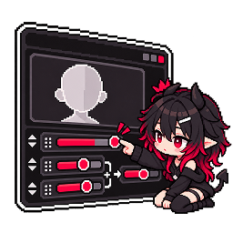

# Blendshape Editor

<p align="center">
  
</p>

<p align="center">
  <strong>既存のシェイプキーを組み合わせて、新しいシェイプキーを作る</strong><br>
  元のFBXを変更せずに、シェイプキーの作成・上書き・並び替えとアバターへの反映を行うAzipa Toolsのエディター拡張です。
</p>

<p align="center">
  
  
  
  
</p>

> [!IMPORTANT]
> **Blendshape Editor はオープンソースではありません。**
>
> このリポジトリではソースコードを公開していますが、Booth で販売している有料のツールです。
> ソースコードやリソースを含め、本ツールを利用できるのは **Booth で購入した方のみ** です。
> 利用する前に、必ず[利用規約](#利用規約)をお読みください。本ツールの購入・ダウンロード・インストールなど、利用を始めた時点で利用規約に同意したものとみなします。
>
> - 購入ページ：Booth（準備中）

## 概要

Blendshape Editorは、アバターの顔などにある既存のシェイプキーを組み合わせて、新しいシェイプキーを作るUnity Editor拡張です。

たとえば、デフォルト表情にジト目が入っているアバターで`vrc.blink`を動かすと、ジト目と瞬きが重なって目の形が崩れることがあります。
「`vrc.blink`を80、ジト目を−35」のように元のシェイプを組み合わせた瞬き用のシェイプを作れば、デフォルト表情を打ち消しながら瞬きできます。

元のFBXは変更せず、シェイプを追加したメッシュを別ファイル（`.asset`）として保存します。保存ファイルには作る前の顔のデータと全シェイプの設定が入っているので、いつでも作り直したり、元に戻したりできます。

## 主な機能

| 機能 | 内容 |
| --- | --- |
| シェイプ作成 | 元にするシェイプと値を指定して合成。限界突破（±100超）、左右分割、既存シェイプの編集に対応 |
| UI用シェイプ作成 | `---- 表情 ----`のような、一覧を区切るための空のシェイプを作成 |
| リアルタイムプレビュー | 値を動かすとシーン上にすぐ反映。プレビュー中かどうかをウィンドウとシーンビューに表示 |
| 既存シェイプの上書き | MMD用の名前などで上書きし、元のシェイプは退避用の見出しの下に残す |
| 並び順の変更 | 既存を含む全シェイプキーをドラッグ＆ドロップで並び替え。Undo / Redo、変更前との比較表示に対応 |
| アバター管理 | 同じ顔のアバターへの反映、反映前に戻す、反映の履歴、瞬き・視線のずれの付け直し |
| 作り直し | アバターのFBXを更新したときに、最新の顔に合わせて全シェイプを作り直す |

## ライセンス（購入が必要です）

Blendshape Editor は有料のツールです。VPM パッケージは VCC / ALCOM から誰でもダウンロードできますが、利用できるのは Booth で購入した方のコンピュータだけです。

1. Booth で Blendshape Editor を購入します（購入ページ：準備中）。
2. ダウンロードした ZIP に入っている `BlendshapeEditor_License.unitypackage` を Unity にインポートします。
3. 「ライセンスをインストールしました」と表示されれば完了です。インストーラーはプロジェクトから自動で削除されます。

この作業は 1 台のコンピュータにつき 1 回だけ必要で、そのコンピュータではどのプロジェクトでも使えます。ライセンスが無いコンピュータでは、ウィンドウに購入の案内だけが表示され、機能は使えません。

- ライセンスの保存場所：Windows はレジストリ（`HKEY_CURRENT_USER\Software\AzipaWorks`）と `%APPDATA%\AzipaWorks`、macOS は `~/Library/Application Support/AzipaWorks`、Linux は `~/.local/share/AzipaWorks`
- ライセンスの削除：`Tools > Azipa Tools > ライセンス管理 > Blendshape Editor ライセンス削除`
- 作成したシェイプ（保存ファイル）は普通のメッシュなので、ライセンスが無くてもアバターでそのまま使えます。

## 利用規約

本ツールの利用規約は、VN3ライセンスに準拠しています。利用する前に、必ず全文をお読みください。

- [Blendshape Editor 利用規約（日本語版）](<Packages/com.azipaworks.blendshape-editor/BlendShape Editor利用規約（日本語版）ver1.0.0.pdf>)
- [Blendshape Editor Terms of Use（英語版）](<Packages/com.azipaworks.blendshape-editor/Blendshape Editor Terms of Use_en.pdf>)

英語版は参考用の翻訳です。内容に違いがある場合は、日本語版が優先されます。

利用規約は、このリポジトリで公開しているソースコードやリソースにも適用されます。GitHub からダウンロードしたデータを使う場合も、利用規約への同意が必要です。

主な内容は次のとおりです（詳しくは利用規約の本文を確認してください）。

| 項目 | 内容 |
| --- | --- |
| 利用 | 個人・法人ともに、営利・非営利を問わず利用できます |
| 作成したシェイプ・アバター | VRChat などへのアップロードや、Public での公開に使えます |
| 再配布 | 本ツールをそのまま再配布することはできません |
| 権利の譲渡 | 本ツールを利用する権利を、他の人に譲ることはできません |
| クレジット表記 | 不要です |

## 動作環境

- Unity `2022.3`
- VRChat Avatarプロジェクト（推奨）

VRChat SDK - Avatarsがある場合は、Avatar Descriptorの瞬き・視線の付け直しと、アップロード前のプレビュー解除が有効になります。SDKが無いプロジェクトでも、シェイプの作成・並び替えは利用できます。

## インストール

### VCC / ALCOM（推奨）

AzipaToolsのVPMリポジトリに本パッケージが公開された後、VCCまたはALCOMへリポジトリを追加し、対象プロジェクトのパッケージ管理画面から **Blendshape Editor** を追加してください。

| 項目 | 値 |
| --- | --- |
| パッケージID | `com.azipaworks.blendshape-editor` |
| 表示名 | `Blendshape Editor` |
| 対応Unity | `2022.3` |

### GitHub Release

Releaseに添付された`com.azipaworks.blendshape-editor-<version>.zip`は、`package.json`が直下にあるVPM互換パッケージです。VPM対応クライアントへZIPを追加して導入できます。

## 起動方法

Unityメニューから次を選択します。

```text
Tools > Azipa Tools > Blendshape Editor
```

ウィンドウ上部の「対象メッシュ」に、シェイプキーを持つ顔の`SkinnedMeshRenderer`を指定します。Hierarchyで選んで「選択中」を押すか、ドラッグ＆ドロップしてください。

## 画面構成

ウィンドウは「作成」と「管理」の2タブです。「管理」は目的別のサブタブに分かれています。対象メッシュと使用中のファイルは、どのタブでも上部に表示されます。

| タブ | 内容 |
| --- | --- |
| 作成 | シェイプ / UI用シェイプを1つずつ作る・編集する |
| 管理 › 作成シェイプ一覧 | 作成したシェイプの確認・編集・削除 |
| 管理 › 並び順 | 全シェイプキーの並び替え（保存ボタンで反映） |
| 管理 › アバター管理 | アバターへの反映・反映前に戻す・瞬き/視線の付け直し・反映の履歴 |
| 管理 › 設定 | 顔のデータの情報、保存ファイルの整理、作り直し、退避用の見出し、退避名の接尾辞 |

## 使い方

### シェイプを作る

1. 「作成」タブの「シェイプの種類」で「シェイプ新規作成」を選びます。
2. 出力シェイプ名を入力します。
   - 「既存シェイプを編集する」をオンにして編集するシェイプを選ぶと、出力名がそのシェイプ名になり、元にするシェイプにそのシェイプ（値100）が入ります。作成済みのシェイプを選んだ場合は、その設定を読み込みます。
3. 「＋ シェイプを追加」で元にするシェイプを追加し、新シェイプ100のときの値をスライダーで調整します。
   - 調整内容はシーンにすぐ反映されます。「新シェイプの値」で途中の状態も確認できます。
   - 「0以外の値が入っているシェイプだけから選ぶ」をオンにすると、デフォルト表情などで値が入っているシェイプだけが候補になり、初期値は今の値を打ち消す値（−現在値）になります。
   - 各行の「打消」で、その行を−現在値にできます。
   - 「限界突破」をオンにすると±100を超えて設定できます（上限は既定±300、100〜1000で変更可）。100を超えた分は同じ方向に直線的に伸びるだけなので、±300を超えると形が崩れやすくなります。
4. 必要に応じて左右分割（左側のみ / 右側のみ）を選びます。
5. 「追加する位置」を選びます。既定は、新規なら末尾（退避用の見出しの上）、既存の上書きなら今の位置です。先頭や「〇〇 の下」も選べます。
6. 「作成」を押して保存します。初回は保存先を選びます（既定 `Assets/BlendshapeEditor_Generated`）。

作成済みと同じ名前なら「更新」になります。保存が終わると入力内容はクリアされます。

### UI用シェイプを作る

「作成」タブの「シェイプの種類」で「UI用シェイプ作成」を選び、名前と追加する位置を指定して作成します。顔は変形しない空のシェイプで、シェイプキー一覧を見やすく区切るために使います。「整形」で`---- 名前 ----`の形に整えられます。

### 既存の名前で作る（MMD用の名前など）

出力シェイプ名に既存の名前（例: `まばたき`）を入れると、次のようになります。

```text
[12] まばたき                    ← 新しいシェイプ（同じ位置・同じ名前）
...
[..] --- Blendshape Editor ---   ← 退避用の見出し（自動で作成）
[..] まばたき_orig               ← 元のシェイプを見出しの下に退避
```

MMDワールドや名前で参照するアニメーション、番号で参照するAvatar Descriptorは、新しいシェイプを使います。退避時は見た目が変わらないよう、元の値を退避先へ移し、新しいシェイプは0にします。

退避名の接尾辞（既定`_orig`）と退避用の見出しの名前は「管理 › 設定」で変更できます。既存の見出し（例: `---- VRCHAT ----`）と同じ名前にすると、その下に置きます。

### 作成したシェイプを確認・編集する

「管理 › 作成シェイプ一覧」に、作成したシェイプが名前と種類（既存シェイプの上書き / 新規 / UI用シェイプ）だけのコンパクトな表示で並びます。行をクリックすると、元にしたシェイプと値などの詳細を表示します。

- 「編集」で作成タブに読み込んで修正できます。
- 「削除」で取り除いて作り直します。既存の名前を上書きしていた場合は、元のシェイプがその名前に戻ります。
- 元にするシェイプがアバターの顔に見つからない設定には⚠を表示します（設定は消さずに残します）。

### 並び順を変える

「管理 › 並び順」で、既存のシェイプを含む全シェイプキーを並び替えます。

- ドラッグ＆ドロップ、または「先頭へ / 上へ / 下へ / 末尾へ」で移動します。クリックで選択、Ctrlで追加選択、Shiftで範囲選択、検索欄で絞り込みができます。
- 並べ替えはCtrl+Z / Ctrl+Y（または画面上のボタン）で取り消し・やり直しができます。
- 「変更前と比較」で、保存済み（左）と編集中（右）を並べて表示します。動かしたシェイプは色付きで、移動量（↑3 / ↓5）を表示します。「移動したものだけ」で絞り込めます。
- 「並び順を保存」を押すと反映されます。退避したシェイプは常に退避用の見出しの直下にまとめられます。

### 他のアバターに反映する・元に戻す

「管理 › アバター管理」に、開いているシーンの全アバターをHierarchyの順で一覧表示します。各アバターについて、使用中のファイル、反映状態、瞬き・視線の状態、「反映前に戻す」で戻る先を確認できます。

- チェックを入れて「反映」を押すと、今の保存ファイルを割り当てます。反映したアバターは、このあと更新した内容も自動で反映されます。
- チェックを入れて「反映前に戻す」を押すと、反映前に記録した状態（使っていたファイル・各シェイプの値・瞬き/視線の設定）に戻します。記録はUnityを再起動しても残ります。
- 「反映の履歴」から、その回の反映だけを取り消せます。
- 顔のデータが異なるファイルのアバターに反映するときは、確認ダイアログを表示します。頂点数が違うなど反映できないアバターは、理由を表示します。

まだシェイプを作っていない顔を開いたとき、同じアバター用に作った保存ファイルがあれば「このアバター用に作ったシェイプがあります」と表示します。「このアバターに使う」で、作り直さずに使えます。

### 瞬き・視線の付け直し

Avatar Descriptorの瞬き・視線は、シェイプを番号で参照しています。並び替えなどで番号が変わると参照がずれるため、次のように扱います。

- 編集中のアバターは、保存時に自動で付け直します。
- 同じファイルを使う他のアバターは、「アバター管理」に「⚠ ずれています」と表示されます。「選ぶ」→「瞬き・視線を付け直す」で、名前を元に付け直します。

ずれの判定は、Descriptorが使っている番号ごとに「設定した時点の並びでの名前」と「今の並びでの名前」を比べて行います。並び替えて元に戻した場合や、瞬き・視線と関係ない場所だけを並び替えた場合は、ずれとは判定しません。

### アバターを更新したとき

アバターのFBXを新しいバージョンに更新したり、顔のシェイプキーを修正したりしたときは、「管理 › 設定」の「最新のアバターに合わせて作り直す」を押してください。作ったシェイプの設定はそのままで、最新の顔に合わせて作り直します。

### 不要なファイルを整理する

「管理 › 設定」の「このアバター用に作ったファイル」から、不要になった保存ファイルを削除できます（ごみ箱へ移動）。

- 開いているシーンで使っているファイルは削除できません。
- シーン・プレハブから参照されている場合は、参照している場所を一覧で表示し、警告してから削除します。

## プレビューについて

プレビューの状態は、ウィンドウとシーンビュー上部の帯で表示します。

| 表示 | 状態 |
| --- | --- |
| オレンジの帯 ＋ シーンビューの枠 | プレビュー中 |
| 青の帯 | 待機中（出力シェイプ名や元にするシェイプが未設定） |
| 灰色の帯 | プレビューOFF / 実際のメッシュを表示中 |

プレビュー中は対象メッシュを一時的に差し替えています。ウィンドウを閉じる・Sceneの保存・Play Mode・アップロードの前に、自動で元に戻します。

## 保存されるデータ

作成したメッシュは`.asset`ファイルとして保存され、次の情報が一緒に入っています。

- シェイプを作る前の顔のデータ（元のFBXのメッシュなど）への参照
- 作成したシェイプの設定と並び順
- 退避名の接尾辞と退避用の見出しの名前
- 並び順の履歴（直近50回）と、アバターごとの瞬き・視線の設定時点
- 反映の履歴と、反映前の状態（直近30回）

元のFBXは変更しません。保存のたびに作る前の顔のデータから全シェイプを作り直すので、何度更新しても結果がずれません。

新シェイプの値xのとき、各元シェイプiを「値_i × x/100」だけ動かしたのと同じ形になります。法線・接線も同様に合成し、元シェイプに中間フレームがある場合は10フレームに分けて焼き込みます。

## 注意事項

- 対象にできるのは、Scene上の`SkinnedMeshRenderer`だけです（Project内のPrefabは対象外）。
- 保存ファイルの更新・削除はファイルの書き換えなのでUndoできません。設定は残るので、作り直しや反映前に戻すことはできます。
- 保存ファイルは元のメッシュを丸ごと含むため、元のメッシュに近いサイズになります。
- 作る前の顔のデータ（FBXなど）を削除・移動すると、その保存ファイルは編集できなくなります。
- 左右分割の境界はアバター中心（ルート空間のX=0）で、左右はキャラクター本人から見た向きです。

## 旧版からの移行

旧名 **Expression Shape Baker** で作った保存ファイル（`Assets/ExpressionShapeBaker_Generated`）は、そのまま読み込めます。

Assets版の次のフォルダーは、VPMインストール時に移行対象として認識されます。

```text
Assets/BlendshapeEditor
```

これにより、Assets版とVPM版が同時に読み込まれてスクリプトが重複することを防ぎます。

## アンインストール

VCCまたはALCOMのパッケージ管理画面から **Blendshape Editor** を削除してください。作成した保存ファイル（`.asset`）はプロジェクトに残るので、アバターはそのまま使えます。

## 開発者向けリリース手順

GitHub Actionsの`Build Release`は、`package.json`のバージョンを使用して次の成果物を生成します。

- VPM用ZIP
- UnityPackage
- `package.json`
- GitタグとGitHub Release

初回のみ、GitHubリポジトリの **Settings > Secrets and variables > Actions > Variables** に次のRepository variableを追加してください。

| Name | Value |
| --- | --- |
| `PACKAGE_NAME` | `com.azipaworks.blendshape-editor` |

Release作成後、GitHubリポジトリをAzipaToolsのVPMリポジトリ定義へ登録すると、VCC / ALCOMから配信できます。

ライセンスインストーラー（`BlendshapeEditor_License.unitypackage`）はこのリポジトリに含めず、Boothの商品にのみ同梱します。

## 変更履歴

[CHANGELOG.md](CHANGELOG.md)を参照してください。
